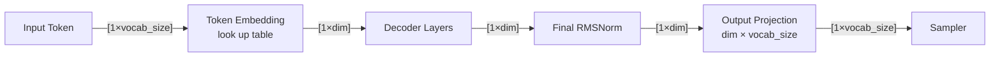
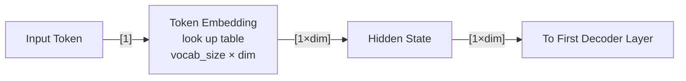
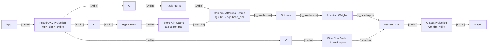
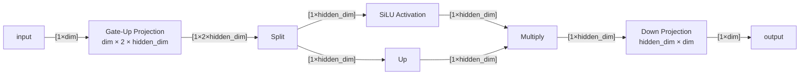
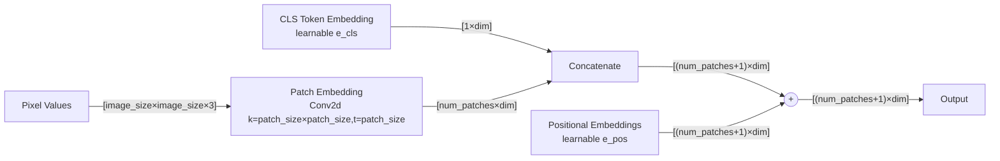
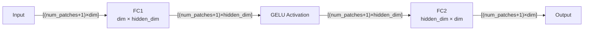

# PHI3

## Overall arch
$\text{vocab size}=32064$  
$\text{dim}=3072$

## Embedding

## Decoder Layer
$\text{n heads}=32$  
$\text{n kv heads}=32$  
$\text{head dim}=96$  
$\text{hidden dim}=8192$  

```mermaid
graph LR
    input_x[Input: x] --[1×dim]--> rms1[RMSNorm]
    rms1 --[1×dim]--> xb1[xb]
    xb1 --[1×dim]--> attn[Multi-Head Self-Attention<br/>with KV Cache]
    
    attn --[1×dim]--> attn_out[attention output]
    input_x --[1×dim]--> residual1[Residual Add]
    attn_out --[1×dim]--> residual1
    residual1 --[1×dim]--> x1[x]
    
    x1 --[1×dim]--> rms2[RMSNorm]
    rms2 --[1×dim]--> xb2[xb]
    xb2 --[1×dim]--> ffn[Feed-Forward Network]
    
    ffn --[1×dim]--> ffn_out[FFN output]
    x1 --[1×dim]--> residual2[Residual Add]
    ffn_out --[1×dim]--> residual2
    residual2 --[1×dim]--> output_x[Output: x]
```

### Multi-Head Self-Attention
With KV Cache

    
### Feed-Forward Network

# CLIP-VIT/L-Patch14

## Overall arch
$\text{image size}=224$  
$\text{patch size}=14$  
$\text{num patches}=256$  
$\text{dim}=1024$  
$\text{n layers}=24$  
$\text{proj dim}=768$  

```mermaid
graph LR
    input_img[Input Image] --[h×w×3]--> preprocess[Preprocessing<br/>Normalize with mean & std]
    preprocess --[image_size×image_size×3]--> embedding[Embedding]
    embedding --[(num_patches+1)×dim]--> pre_ln[Pre-LayerNorm]
    pre_ln --[(num_patches+1)×dim]--> encoder[Encoder Layers]
    encoder --[(num_patches+1)×dim]--> post_ln[Post-LayerNorm]
    post_ln --[(num_patches+1)×dim]--> proj[Projection]
    proj --[(num_patches+1)×proj_dim]--> final[Output Features]
```

## Embedding

## Encoder Layer
$\text{n heads}=16$  
$\text{head dim}=64$  
$\text{hidden dim}=4096$  

```mermaid
graph LR
    input_x[Input] --[(num_patches+1)×dim]--> ln1[LayerNorm 1<br/>w_ln1, b_ln1]
    ln1 --[(num_patches+1)×dim]--> attn[Multi-Head Self-Attention]
    input_x --[(num_patches+1)×dim]--> residual1((+))
    attn --[(num_patches+1)×dim]--> residual1
    
    residual1 --[(num_patches+1)×dim]--> ln2[LayerNorm 2<br/>w_ln2, b_ln2]
    ln2 --[(num_patches+1)×dim]--> ffn[Feed-Forward Network]
    residual1 --[(num_patches+1)×dim]--> residual2((+))
    ffn --[(num_patches+1)×dim]--> residual2
    residual2 --[(num_patches+1)×dim]--> output_x[Output: x]
```

### Multi-Head Self-Attention
Without KV Cache

```mermaid
graph LR
        attn_in[xb] --[(num_patches+1)×dim]--> proj_q[Q Projection<br/>dim × dim]
        attn_in --[(num_patches+1)×dim]--> proj_k[K Projection<br/>dim × dim]
        attn_in --[(num_patches+1)×dim]--> proj_v[V Projection<br/>dim × dim]
        proj_q --[(num_patches+1)×dim]--> q[Reshape for Multi-Head]
        proj_k --[(num_patches+1)×dim]--> k[Reshape for Multi-Head]
        proj_v --[(num_patches+1)×dim]--> v[Reshape for Multi-Head]
        q --[n_heads×seq_len×head_dim]--> scores[Attention Scores<br/>Dot prodoct]
        k --[n_heads×seq_len×head_dim]--> scores
        scores --[n_heads×seq_len×seq_len]--> softmax[Softmax]
        softmax --[n_heads×seq_len×seq_len]--> matmul_v[Attention × V]
        v --[n_heads×seq_len×head_dim]--> matmul_v
        matmul_v --[n_heads×seq_len×head_dim]--> concat[Concatenate Heads]
        concat --[(num_patches+1)×dim]--> proj_o[Output Projection<br/>dim × dim]
        proj_o --[(num_patches+1)×dim]--> attn_out2[output]
```

### Feedforward
